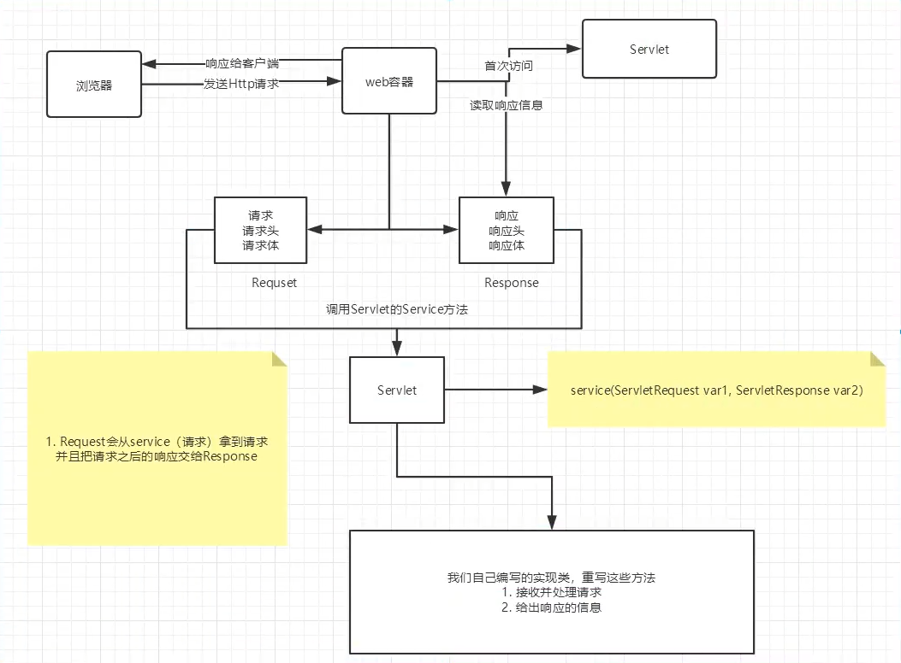
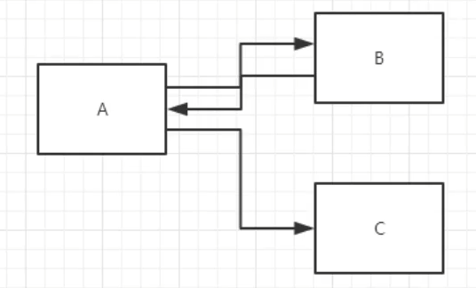
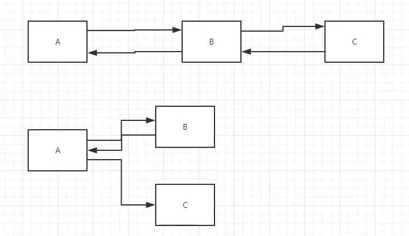
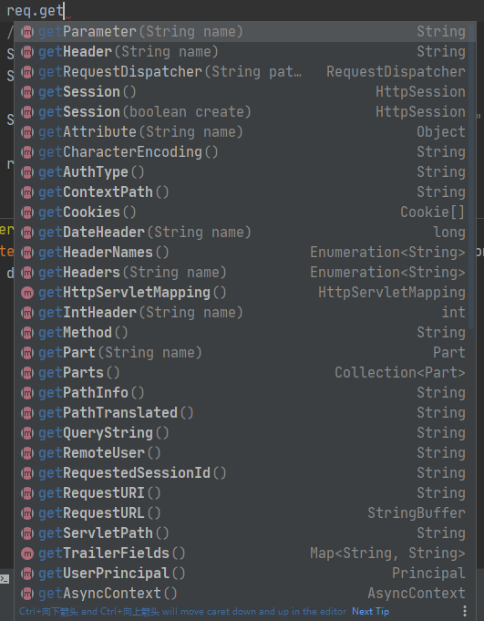
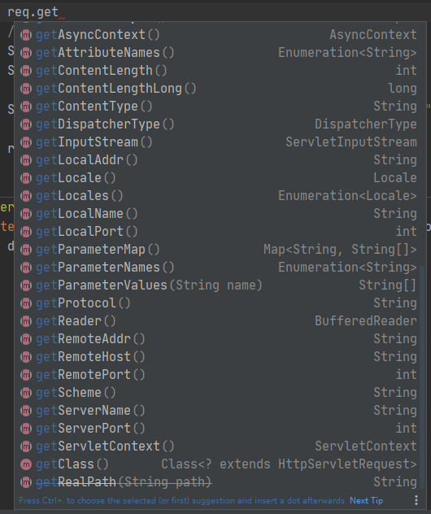

#JavaWeb
##Servlet
### 1.Servlet原理
Servlet是由Web服务器调用，web服务器在收到浏览器请求后，会：


### 2.Mapping
* 一个Servlet可以指定一个映射路径
    ```xml
    <servlet-mapping>
       <servlet-name>hello</servlet-name>
       <url-pattern>/hello</url-pattern>
    </servlet-mapping>
    ```
* 一个Servlet可以指定多个映射路径
    ```xml
    <servlet-mapping>
       <servlet-name>hello</servlet-name>
       <url-pattern>/hello1</url-pattern>
    </servlet-mapping>
    <servlet-mapping>
       <servlet-name>hello</servlet-name>
       <url-pattern>/hello2</url-pattern>
    </servlet-mapping>    
    ```
* 一个Servlet可以指定通用映射路径
    ```xml
    <servlet-mapping>
       <servlet-name>hello</servlet-name>
       <url-pattern>/hello/*</url-pattern>
    </servlet-mapping>
   ```
* 默认请求路径->会干掉index.jsp
    ```xml
    <servlet-mapping>
       <servlet-name>hello</servlet-name>
       <url-pattern>/*</url-pattern>
    </servlet-mapping>
    ```
* 指定一些后缀或者前缀等等
    ```xml
    <!--*前面不能加项目映射的路径-->
    <servlet-mapping>
       <servlet-name>hello</servlet-name>
       <url-pattern>*.do</url-pattern>
    </servlet-mapping>
    ```
* 优先级问题  
    指定了固有的映射路径优先级最高，如果找不到就会走默认的处理请求
    ```xml
    <servlet>
       <servlet-name>error</servlet-name>
       <servlet-class>top.aranlzh.servlet.ErrorServlet</servlet-class>
    </servlet>
    <servlet-mapping>
       <servlet-name>hello</servlet-name>
       <url-pattern>*.do</url-pattern>
    </servlet-mapping>
    ```
### 3.ServletContext
#### 共享数据
在HelloServlet中保存的数据，可以在另外一个Servlet中拿到  
HelloServlet.java
```java
public class HelloServlet extends HttpServlet {

    // 由于get或者post只是请求实现的不同方式，可以相互调用，业务逻辑都一样
    @Override
    protected void doGet(HttpServletRequest req, HttpServletResponse resp) throws ServletException, IOException {
        ServletContext context = this.getServletContext();
        String username = "阿然";
        // 将一个数据保存在了ServletContext中，名字为："username"，值：username
        context.setAttribute("username", username);
    }

    @Override
    protected void doPost(HttpServletRequest req, HttpServletResponse resp) throws ServletException, IOException {
        doGet(req, resp);
    }
}
```
GetServlet.java
```java
public class GetServlet extends HttpServlet {

    @Override
    protected void doGet(HttpServletRequest req, HttpServletResponse resp) throws ServletException, IOException {
        ServletContext context = this.getServletContext();

        String username = (String) context.getAttribute("username");

        resp.setContentType("text/html");
        resp.setCharacterEncoding("utf-8");
        resp.getWriter().print("名字:"+username);
    }

    @Override
    protected void doPost(HttpServletRequest req, HttpServletResponse resp) throws ServletException, IOException {
        doGet(req, resp);
    }
}
```
web.xml  
配置servlet访问路径等参数
```xml
    <servlet>
        <servlet-name>hello</servlet-name>
        <servlet-class>HelloServlet</servlet-class>
    </servlet>
    <servlet-mapping>
        <servlet-name>hello</servlet-name>
        <url-pattern>/hello</url-pattern>
    </servlet-mapping>

    <servlet>
        <servlet-name>get</servlet-name>
        <servlet-class>GetServlet</servlet-class>
    </servlet>
    <servlet-mapping>
        <servlet-name>get</servlet-name>
        <url-pattern>/get</url-pattern>
    </servlet-mapping>
```
#### 获取初始化参数

```java
public class ReadServlet extends HttpServlet {

    @Override
    protected void doGet(HttpServletRequest req, HttpServletResponse resp) throws ServletException, IOException {
        ServletContext context = this.getServletContext();
        String url = context.getInitParameter("url");
        resp.getWriter().print(url);
    }

    @Override
    protected void doPost(HttpServletRequest req, HttpServletResponse resp) throws ServletException, IOException {
        doGet(req, resp);
    }
}
```

```xml
<!--配置一些web应用初始化参数-->
<context-param>
    <param-name>url</param-name>
    <param-value>jdbc:mysql://localhost:3306/db</param-value>
</context-param>
```
#### 请求转发

```java
public class ForwardServlet extends HttpServlet {

    @Override
    protected void doGet(HttpServletRequest req, HttpServletResponse resp) throws ServletException, IOException {
        System.out.println("进入了ForwardServlet。。。");
        ServletContext context = this.getServletContext();
        // 转发的请求路径
        //RequestDispatcher requestDispatcher = context.getRequestDispatcher("/hello");
        //requestDispatcher.forward(req,resp);
        context.getRequestDispatcher("/hello").forward(req,resp);
    }

    @Override
    protected void doPost(HttpServletRequest req, HttpServletResponse resp) throws ServletException, IOException {
        doGet(req, resp);
    }
}
```

```xml
<servlet>
    <servlet-name>forward</servlet-name>
    <servlet-class>ForwardServlet</servlet-class>
</servlet>
<servlet-mapping>
    <servlet-name>forward</servlet-name>
    <url-pattern>/forward</url-pattern>
</servlet-mapping>
```
这个时候浏览器会显示/hello的内容，但是url不变
#### 读取资源文件
Properties
* 在Java目录下新建properties
* 在resource目录下新建properties

发现：都被打包到同一个路径下：classes，我们俗称这个路径为classpath；

pom.xml中配置文件过滤
```xml
<!--在build中配置resource，来防止我们资源导出失败的问题-->
<!--在父工程或者每个子模块的pom.xml配置文件中添加以下配置 。-->
<build>
    <!--配置打包时不过滤非java文件开始  -->
    <!--说明，在进行模块化开发打jar包时，maven会将非java文件过滤掉，
    xml,properties配置文件等，但是这些文件又是必需的，
    使用此配置可以在打包时将不会过滤这些必需的配置文件。
    -->
    <resources>
        <resource>
            <directory>src/main/java</directory>
            <includes>
                <include>**/*.properties</include>
                <include>**/*.xml</include>
            </includes>
            <filtering>false</filtering>
        </resource>
        <resource>
            <directory>src/main/resources</directory>
            <includes>
                <include>**/*.properties</include>
                <include>**/*.xml</include>
            </includes>
            <filtering>false</filtering>
        </resource>
    </resources>
    <!--配置打包时不过滤非java文件结束 -->
</build>
```

```java
public class PropertiesServlet extends HttpServlet {

    @Override
    protected void doGet(HttpServletRequest req, HttpServletResponse resp) throws ServletException, IOException {
        InputStream db = this.getServletContext().getResourceAsStream("/WEB-INF/classes/db.properties");

        Properties prop = new Properties();
        prop.load(db);
        String username = prop.getProperty("username");
        String password = prop.getProperty("password");
        resp.getWriter().println("username:"+username+" \npassword:"+password);

        InputStream test = this.getServletContext().getResourceAsStream("/WEB-INF/classes/top/aranlzh/servlet/test.properties");
        prop.load(test);
        String name = prop.getProperty("name");
        resp.getWriter().println("name:"+name);
    }

    @Override
    protected void doPost(HttpServletRequest req, HttpServletResponse resp) throws ServletException, IOException {
        doGet(req, resp);
    }
}
```

### 4.HttpServletResponse
web服务器接收到客户端的http请求，针对这个请求，分别创建一个代表请求的HttpServletRequest对象，代表响应的一个分别创建一个代表请求的HttpServletResponse对象；
* 如果要获取客户端请求过来的参数：找HttpServletRequest
* 如果要给客户端响应一些信息：找HttpServletResponse
#### 简单分类
**负责向浏览器发送数据的方法**
```java
ServletOutputStream getOutputStream() throws IOException;
PrintWriter getWriter() throws IOException;
```
**负责向浏览器发送响应头的方法**
```java
void setCharacterEncoding(String var1);
void setContentLength(int var1);
void setContentLengthLong(long var1);
void setContentType(String var1);
void setDataHeader(String var1, long var2);
void addDataHeader(String var1, long var2);
void setHeader(String var1, String var2);
void addHeader(String var1, String var2);
void setIntHeader(String var1, int var2);
void addIntHeader(String var1, int var2);
......
```
**响应的状态码**
```java
int SC_CONTINUE = 100;
int SC_SWITCHING_PROTOCOLS = 101;
int SC_OK = 200;
int SC_CREATED = 201;
int SC_ACCEPTED = 202;
int SC_NON_AUTHORITATIVE_INFORMATION = 203;
int SC_NO_CONTENT = 204;
int SC_RESET_CONTENT = 205;
int SC_PARTIAL_CONTENT = 206;
int SC_MULTIPLE_CHOICES = 300;
int SC_MOVED_PERMANENTLY = 301;
int SC_MOVED_TEMPORARILY = 302;
int SC_FOUND = 302;
int SC_SEE_OTHER = 303;
int SC_NOT_MODIFIED = 304;
int SC_USE_PROXY = 305;
int SC_TEMPORARY_REDIRECT = 307;
int SC_BAD_REQUEST = 400;
int SC_UNAUTHORIZED = 401;
int SC_PAYMENT_REQUIRED = 402;
int SC_FORBIDDEN = 403;
int SC_NOT_FOUND = 404;
int SC_METHOD_NOT_ALLOWED = 405;
int SC_NOT_ACCEPTABLE = 406;
int SC_PROXY_AUTHENTICATION_REQUIRED = 407;
int SC_REQUEST_TIMEOUT = 408;
int SC_CONFLICT = 409;
int SC_GONE = 410;
int SC_LENGTH_REQUIRED = 411;
int SC_PRECONDITION_FAILED = 412;
int SC_REQUEST_ENTITY_TOO_LARGE = 413;
int SC_REQUEST_URI_TOO_LONG = 414;
int SC_UNSUPPORTED_MEDIA_TYPE = 415;
int SC_REQUESTED_RANGE_NOT_SATISFIABLE = 416;
int SC_EXPECTATION_FAILED = 417;
int SC_INTERNAL_SERVER_ERROR = 500;
int SC_NOT_IMPLEMENTED = 501;
int SC_BAD_GATEWAY = 502;
int SC_SERVICE_UNAVAILABLE = 503;
int SC_GATEWAY_TIMEOUT = 504;
int SC_HTTP_VERSION_NOT_SUPPORTED = 505;
```
#### 常见应用
**向浏览器输出消息**
```java
public class ErrorServlet extends HttpServlet {
    @Override
    protected void doGet(HttpServletRequest req, HttpServletResponse resp) throws ServletException, IOException {
        resp.setContentType("text/html");
        resp.setCharacterEncoding("utf-8");
        // 响应流
        resp.getWriter().print("<h1>404</h1>");
    }

    @Override
    protected void doPost(HttpServletRequest req, HttpServletResponse resp) throws ServletException, IOException {
        doGet(req, resp);
    }
}
```
**下载文件**
* 要获取下载文件的路径
* 下载的文件名是啥？
* 设置想办法让浏览器能够支持下载我们需要的东西
* 获取下载文件的输入流
* 创建缓冲区
* 获取OutputStream对象
* 将FileOutputStream流写入buffer缓冲区
* 使用OutputStream将缓冲区中的数据输出到客户端
```java
public class FileServlet extends HttpServlet {

    @Override
    protected void doGet(HttpServletRequest req, HttpServletResponse resp) throws ServletException, IOException {
        // 要获取下载文件的路径
        String realPath = this.getServletContext().getRealPath("/WEB-INF/classes/test.jpg");
        // String realPath = "D:\\Study\\javaweb-study\\javaweb-01-servlet\\target\\classes\\test.jpg";
        System.out.println("下载文件的路径"+realPath);
        // 下载的文件名是啥？
        String fileName = realPath.substring(realPath.lastIndexOf("\\") + 1);
        // 设置想办法让浏览器能够支持(Content-Disposition)下载我们需要的东西，中文文件名URLEncoder.encode编码，否住可能乱码
        resp.setHeader("Content-Disposition","attachment;filename="+URLEncoder.encode(fileName));

        // 获取下载文件的输入流
        FileInputStream in = new FileInputStream(realPath);
        // 创建缓冲区
        int len = 0;
        byte[] buffer = new byte[1024];
        // 获取OutputStream对象
        ServletOutputStream out = resp.getOutputStream();
        // 将FileOutputStream流写入buffer缓冲区，使用OutputStream将缓冲区中的数据输出到客户端
        while ((len=in.read(buffer))>0) {
            out.write(buffer, 0, len);
        }

        in.close();
        out.close();

    }

    @Override
    protected void doPost(HttpServletRequest req, HttpServletResponse resp) throws ServletException, IOException {
        doGet(req, resp);
    }
}
```
**验证码功能**
* 前端实现
* 后端实现，需要用到Java的图片类，生成图片，然后通过response设置返回输出给浏览器
```java
public class ImageServlet extends HttpServlet {
    @Override
    protected void doGet(HttpServletRequest req, HttpServletResponse resp) throws ServletException, IOException {
        // 如何让浏览器3秒自动刷新一次
        resp.setHeader("refresh","3");

        // 在内存中创建一个图片
        BufferedImage image = new BufferedImage(80, 20, BufferedImage.TYPE_INT_BGR);
        // 得到图片
        // 拿到笔
        Graphics2D g = (Graphics2D) image.getGraphics();
        // 设置图片的背景颜色
        g.setColor(Color.WHITE);
        g.fillRect(0,0,80,20);
        // 给图片写数据
        g.setColor(Color.BLUE);
        g.setFont(new Font("宋体", Font.BOLD, 20));
        g.drawString(makeNum(), 0,20);

        // 告诉浏览器，这个请求用图片的方式打开
        resp.setContentType("image/jpeg");
        // 网站存在缓存，不让浏览器缓存
        resp.setDateHeader("expires",-1);
        resp.setHeader("Cache-Conrol","no-cache");
        resp.setHeader("Pragma","no-cache");

        // 把图片写给浏览器
        ImageIO.write(image,"jpg", resp.getOutputStream());

    }

    private String makeNum() {
        Random random = new Random();
        String num = random.nextInt(9999999) + "";
        StringBuffer sb = new StringBuffer();
        for (int i = 0; i < 7 - num.length(); i++) {
            sb.append(random.nextInt(9) + "");
        }
        num = sb.toString() + num;
        return num;
    }

    @Override
    protected void doPost(HttpServletRequest req, HttpServletResponse resp) throws ServletException, IOException {
        doGet(req, resp);
    }
}
```
**实现重定向**

一个web资源（B）收到客户端（A）请求后，他会通知客户端（A）去访问另外一个web资源（C），这个过程叫重定向。
常见场景：
* 用户登录
```java
void sendRedirect(String location) throws IOException;
```
测试：
```java
public class RedirectServlet extends HttpServlet {

    @Override
    protected void doGet(HttpServletRequest req, HttpServletResponse resp) throws ServletException, IOException {

        // 重定向：
        // 路径会变，有项目名需要加上/项目名
        resp.sendRedirect("/img");
        // 等同于
        // resp.setHeader("Location","/img");
        // resp.setStatus(HttpServletResponse.SC_MOVED_TEMPORARILY);

    }

    @Override
    protected void doPost(HttpServletRequest req, HttpServletResponse resp) throws ServletException, IOException {
        doGet(req, resp);
    }
}
```
面试题：请你聊聊重定向和转发的区别？

相同点：
* 页面都会跳转

不同点：
* 请求转发的时候，url不会产生变化；
* 重定向的时候，url地址栏会发生变化；

### 5.HttpServletRequest
HttpServletRequest代表客户端的请求，用户通过http协议访问服务器，HTTP请求中的所有信息会被封装到HttpServletRequest，通过HttpServletRequest的方法，获取客户端的所有信息  



**获取客户端请求过来的参数**
```java
String getParameter(String name);
String[] getParameterValues(String name);
```
**请求转发**
```java
req.getRequestDispatcher(req.getContextPath()+"/path").forward(req,resp);
```
测试：
```java
public class LoginServlet extends HttpServlet {
    @Override
    protected void doGet(HttpServletRequest req, HttpServletResponse resp) throws ServletException, IOException {
        req.setCharacterEncoding("utf-8");
        resp.setCharacterEncoding("utf-8");
        // 处理请求
        String username = req.getParameter("username");
        String password = req.getParameter("password");
        System.out.println("username:" + username + " \npassword:" + password);
        // 重定向
        resp.sendRedirect(req.getContextPath()+"/success.jsp");
    }

    @Override
    protected void doPost(HttpServletRequest req, HttpServletResponse resp) throws ServletException, IOException {
        req.setCharacterEncoding("utf-8");
        resp.setCharacterEncoding("utf-8");
        // 处理请求
        String username = req.getParameter("username");
        String password = req.getParameter("password");
        String[] hobbies = req.getParameterValues("hobby");
        System.out.println("username:" + username + " \npassword:" + password+ " \nhobby:" + Arrays.toString(hobbies));
        // 转发
        req.getRequestDispatcher(req.getContextPath()+"/success.jsp").forward(req,resp);
    }
}
```
### 6.Cookie

### 7.Session

## JSP
