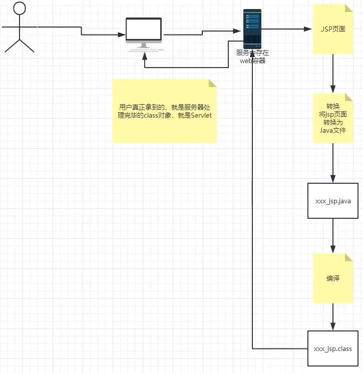
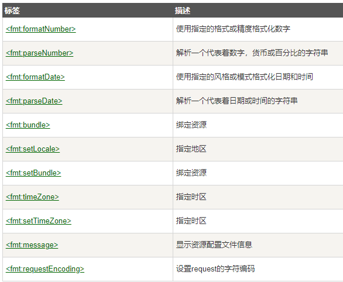

#JavaWeb
##Servlet
### 1.Servlet原理
Servlet是由Web服务器调用，web服务器在收到浏览器请求后，会：


### 2.Mapping
* 一个Servlet可以指定一个映射路径
    ```xml
    <servlet-mapping>
       <servlet-name>hello</servlet-name>
       <url-pattern>/hello</url-pattern>
    </servlet-mapping>
    ```
* 一个Servlet可以指定多个映射路径
    ```xml
    <servlet-mapping>
       <servlet-name>hello</servlet-name>
       <url-pattern>/hello1</url-pattern>
    </servlet-mapping>
    <servlet-mapping>
       <servlet-name>hello</servlet-name>
       <url-pattern>/hello2</url-pattern>
    </servlet-mapping>    
    ```
* 一个Servlet可以指定通用映射路径
    ```xml
    <servlet-mapping>
       <servlet-name>hello</servlet-name>
       <url-pattern>/hello/*</url-pattern>
    </servlet-mapping>
   ```
* 默认请求路径->会干掉index.jsp
    ```xml
    <servlet-mapping>
       <servlet-name>hello</servlet-name>
       <url-pattern>/*</url-pattern>
    </servlet-mapping>
    ```
* 指定一些后缀或者前缀等等
    ```xml
    <!--*前面不能加项目映射的路径-->
    <servlet-mapping>
       <servlet-name>hello</servlet-name>
       <url-pattern>*.do</url-pattern>
    </servlet-mapping>
    ```
* 优先级问题  
    指定了固有的映射路径优先级最高，如果找不到就会走默认的处理请求
    ```xml
    <servlet>
       <servlet-name>error</servlet-name>
       <servlet-class>top.aranlzh.servlet.ErrorServlet</servlet-class>
    </servlet>
    <servlet-mapping>
       <servlet-name>hello</servlet-name>
       <url-pattern>*.do</url-pattern>
    </servlet-mapping>
    ```
### 3.ServletContext
#### 共享数据
在HelloServlet中保存的数据，可以在另外一个Servlet中拿到  
HelloServlet.java
```java
public class HelloServlet extends HttpServlet {

    // 由于get或者post只是请求实现的不同方式，可以相互调用，业务逻辑都一样
    @Override
    protected void doGet(HttpServletRequest req, HttpServletResponse resp) throws ServletException, IOException {
        ServletContext context = this.getServletContext();
        String username = "阿然";
        // 将一个数据保存在了ServletContext中，名字为："username"，值：username
        context.setAttribute("username", username);
    }

    @Override
    protected void doPost(HttpServletRequest req, HttpServletResponse resp) throws ServletException, IOException {
        doGet(req, resp);
    }
}
```
GetServlet.java
```java
public class GetServlet extends HttpServlet {

    @Override
    protected void doGet(HttpServletRequest req, HttpServletResponse resp) throws ServletException, IOException {
        ServletContext context = this.getServletContext();

        String username = (String) context.getAttribute("username");

        resp.setContentType("text/html");
        resp.setCharacterEncoding("utf-8");
        resp.getWriter().print("名字:"+username);
    }

    @Override
    protected void doPost(HttpServletRequest req, HttpServletResponse resp) throws ServletException, IOException {
        doGet(req, resp);
    }
}
```
web.xml  
配置servlet访问路径等参数
```xml
    <servlet>
        <servlet-name>hello</servlet-name>
        <servlet-class>HelloServlet</servlet-class>
    </servlet>
    <servlet-mapping>
        <servlet-name>hello</servlet-name>
        <url-pattern>/hello</url-pattern>
    </servlet-mapping>

    <servlet>
        <servlet-name>get</servlet-name>
        <servlet-class>GetServlet</servlet-class>
    </servlet>
    <servlet-mapping>
        <servlet-name>get</servlet-name>
        <url-pattern>/get</url-pattern>
    </servlet-mapping>
```
#### 获取初始化参数

```java
public class ReadServlet extends HttpServlet {

    @Override
    protected void doGet(HttpServletRequest req, HttpServletResponse resp) throws ServletException, IOException {
        ServletContext context = this.getServletContext();
        String url = context.getInitParameter("url");
        resp.getWriter().print(url);
    }

    @Override
    protected void doPost(HttpServletRequest req, HttpServletResponse resp) throws ServletException, IOException {
        doGet(req, resp);
    }
}
```

```xml
<!--配置一些web应用初始化参数-->
<context-param>
    <param-name>url</param-name>
    <param-value>jdbc:mysql://localhost:3306/db</param-value>
</context-param>
```
#### 请求转发

```java
public class ForwardServlet extends HttpServlet {

    @Override
    protected void doGet(HttpServletRequest req, HttpServletResponse resp) throws ServletException, IOException {
        System.out.println("进入了ForwardServlet。。。");
        ServletContext context = this.getServletContext();
        // 转发的请求路径
        //RequestDispatcher requestDispatcher = context.getRequestDispatcher("/hello");
        //requestDispatcher.forward(req,resp);
        context.getRequestDispatcher("/hello").forward(req,resp);
    }

    @Override
    protected void doPost(HttpServletRequest req, HttpServletResponse resp) throws ServletException, IOException {
        doGet(req, resp);
    }
}
```

```xml
<servlet>
    <servlet-name>forward</servlet-name>
    <servlet-class>ForwardServlet</servlet-class>
</servlet>
<servlet-mapping>
    <servlet-name>forward</servlet-name>
    <url-pattern>/forward</url-pattern>
</servlet-mapping>
```
这个时候浏览器会显示/hello的内容，但是url不变
#### 读取资源文件
Properties
* 在Java目录下新建properties
* 在resource目录下新建properties

发现：都被打包到同一个路径下：classes，我们俗称这个路径为classpath；

pom.xml中配置文件过滤
```xml
<!--在build中配置resource，来防止我们资源导出失败的问题-->
<!--在父工程或者每个子模块的pom.xml配置文件中添加以下配置 。-->
<build>
    <!--配置打包时不过滤非java文件开始  -->
    <!--说明，在进行模块化开发打jar包时，maven会将非java文件过滤掉，
    xml,properties配置文件等，但是这些文件又是必需的，
    使用此配置可以在打包时将不会过滤这些必需的配置文件。
    -->
    <resources>
        <resource>
            <directory>src/main/java</directory>
            <includes>
                <include>**/*.properties</include>
                <include>**/*.xml</include>
            </includes>
            <filtering>false</filtering>
        </resource>
        <resource>
            <directory>src/main/resources</directory>
            <includes>
                <include>**/*.properties</include>
                <include>**/*.xml</include>
            </includes>
            <filtering>false</filtering>
        </resource>
    </resources>
    <!--配置打包时不过滤非java文件结束 -->
</build>
```

```java
public class PropertiesServlet extends HttpServlet {

    @Override
    protected void doGet(HttpServletRequest req, HttpServletResponse resp) throws ServletException, IOException {
        InputStream db = this.getServletContext().getResourceAsStream("/WEB-INF/classes/db.properties");

        Properties prop = new Properties();
        prop.load(db);
        String username = prop.getProperty("username");
        String password = prop.getProperty("password");
        resp.getWriter().println("username:"+username+" \npassword:"+password);

        InputStream test = this.getServletContext().getResourceAsStream("/WEB-INF/classes/top/aranlzh/servlet/test.properties");
        prop.load(test);
        String name = prop.getProperty("name");
        resp.getWriter().println("name:"+name);
    }

    @Override
    protected void doPost(HttpServletRequest req, HttpServletResponse resp) throws ServletException, IOException {
        doGet(req, resp);
    }
}
```

### 4.HttpServletResponse
web服务器接收到客户端的http请求，针对这个请求，分别创建一个代表请求的HttpServletRequest对象，代表响应的一个分别创建一个代表请求的HttpServletResponse对象；
* 如果要获取客户端请求过来的参数：找HttpServletRequest
* 如果要给客户端响应一些信息：找HttpServletResponse
#### 简单分类
**负责向浏览器发送数据的方法**
```java
ServletOutputStream getOutputStream() throws IOException;
PrintWriter getWriter() throws IOException;
```
**负责向浏览器发送响应头的方法**
```java
void setCharacterEncoding(String var1);
void setContentLength(int var1);
void setContentLengthLong(long var1);
void setContentType(String var1);
void setDataHeader(String var1, long var2);
void addDataHeader(String var1, long var2);
void setHeader(String var1, String var2);
void addHeader(String var1, String var2);
void setIntHeader(String var1, int var2);
void addIntHeader(String var1, int var2);
......
```
**响应的状态码**
```java
int SC_CONTINUE = 100;
int SC_SWITCHING_PROTOCOLS = 101;
int SC_OK = 200;
int SC_CREATED = 201;
int SC_ACCEPTED = 202;
int SC_NON_AUTHORITATIVE_INFORMATION = 203;
int SC_NO_CONTENT = 204;
int SC_RESET_CONTENT = 205;
int SC_PARTIAL_CONTENT = 206;
int SC_MULTIPLE_CHOICES = 300;
int SC_MOVED_PERMANENTLY = 301;
int SC_MOVED_TEMPORARILY = 302;
int SC_FOUND = 302;
int SC_SEE_OTHER = 303;
int SC_NOT_MODIFIED = 304;
int SC_USE_PROXY = 305;
int SC_TEMPORARY_REDIRECT = 307;
int SC_BAD_REQUEST = 400;
int SC_UNAUTHORIZED = 401;
int SC_PAYMENT_REQUIRED = 402;
int SC_FORBIDDEN = 403;
int SC_NOT_FOUND = 404;
int SC_METHOD_NOT_ALLOWED = 405;
int SC_NOT_ACCEPTABLE = 406;
int SC_PROXY_AUTHENTICATION_REQUIRED = 407;
int SC_REQUEST_TIMEOUT = 408;
int SC_CONFLICT = 409;
int SC_GONE = 410;
int SC_LENGTH_REQUIRED = 411;
int SC_PRECONDITION_FAILED = 412;
int SC_REQUEST_ENTITY_TOO_LARGE = 413;
int SC_REQUEST_URI_TOO_LONG = 414;
int SC_UNSUPPORTED_MEDIA_TYPE = 415;
int SC_REQUESTED_RANGE_NOT_SATISFIABLE = 416;
int SC_EXPECTATION_FAILED = 417;
int SC_INTERNAL_SERVER_ERROR = 500;
int SC_NOT_IMPLEMENTED = 501;
int SC_BAD_GATEWAY = 502;
int SC_SERVICE_UNAVAILABLE = 503;
int SC_GATEWAY_TIMEOUT = 504;
int SC_HTTP_VERSION_NOT_SUPPORTED = 505;
```
#### 常见应用
**向浏览器输出消息**
```java
public class ErrorServlet extends HttpServlet {
    @Override
    protected void doGet(HttpServletRequest req, HttpServletResponse resp) throws ServletException, IOException {
        resp.setContentType("text/html");
        resp.setCharacterEncoding("utf-8");
        // 响应流
        resp.getWriter().print("<h1>404</h1>");
    }

    @Override
    protected void doPost(HttpServletRequest req, HttpServletResponse resp) throws ServletException, IOException {
        doGet(req, resp);
    }
}
```
**下载文件**
* 要获取下载文件的路径
* 下载的文件名是啥？
* 设置想办法让浏览器能够支持下载我们需要的东西
* 获取下载文件的输入流
* 创建缓冲区
* 获取OutputStream对象
* 将FileOutputStream流写入buffer缓冲区
* 使用OutputStream将缓冲区中的数据输出到客户端
```java
public class FileServlet extends HttpServlet {

    @Override
    protected void doGet(HttpServletRequest req, HttpServletResponse resp) throws ServletException, IOException {
        // 要获取下载文件的路径
        String realPath = this.getServletContext().getRealPath("/WEB-INF/classes/test.jpg");
        // String realPath = "D:\\Study\\javaweb-study\\javaweb-01-servlet\\target\\classes\\test.jpg";
        System.out.println("下载文件的路径"+realPath);
        // 下载的文件名是啥？
        String fileName = realPath.substring(realPath.lastIndexOf("\\") + 1);
        // 设置想办法让浏览器能够支持(Content-Disposition)下载我们需要的东西，中文文件名URLEncoder.encode编码，否住可能乱码
        resp.setHeader("Content-Disposition","attachment;filename="+URLEncoder.encode(fileName));

        // 获取下载文件的输入流
        FileInputStream in = new FileInputStream(realPath);
        // 创建缓冲区
        int len = 0;
        byte[] buffer = new byte[1024];
        // 获取OutputStream对象
        ServletOutputStream out = resp.getOutputStream();
        // 将FileOutputStream流写入buffer缓冲区，使用OutputStream将缓冲区中的数据输出到客户端
        while ((len=in.read(buffer))>0) {
            out.write(buffer, 0, len);
        }

        in.close();
        out.close();

    }

    @Override
    protected void doPost(HttpServletRequest req, HttpServletResponse resp) throws ServletException, IOException {
        doGet(req, resp);
    }
}
```
**验证码功能**
* 前端实现
* 后端实现，需要用到Java的图片类，生成图片，然后通过response设置返回输出给浏览器
```java
public class ImageServlet extends HttpServlet {
    @Override
    protected void doGet(HttpServletRequest req, HttpServletResponse resp) throws ServletException, IOException {
        // 如何让浏览器3秒自动刷新一次
        resp.setHeader("refresh","3");

        // 在内存中创建一个图片
        BufferedImage image = new BufferedImage(80, 20, BufferedImage.TYPE_INT_BGR);
        // 得到图片
        // 拿到笔
        Graphics2D g = (Graphics2D) image.getGraphics();
        // 设置图片的背景颜色
        g.setColor(Color.WHITE);
        g.fillRect(0,0,80,20);
        // 给图片写数据
        g.setColor(Color.BLUE);
        g.setFont(new Font("宋体", Font.BOLD, 20));
        g.drawString(makeNum(), 0,20);

        // 告诉浏览器，这个请求用图片的方式打开
        resp.setContentType("image/jpeg");
        // 网站存在缓存，不让浏览器缓存
        resp.setDateHeader("expires",-1);
        resp.setHeader("Cache-Conrol","no-cache");
        resp.setHeader("Pragma","no-cache");

        // 把图片写给浏览器
        ImageIO.write(image,"jpg", resp.getOutputStream());

    }

    private String makeNum() {
        Random random = new Random();
        String num = random.nextInt(9999999) + "";
        StringBuffer sb = new StringBuffer();
        for (int i = 0; i < 7 - num.length(); i++) {
            sb.append(random.nextInt(9) + "");
        }
        num = sb.toString() + num;
        return num;
    }

    @Override
    protected void doPost(HttpServletRequest req, HttpServletResponse resp) throws ServletException, IOException {
        doGet(req, resp);
    }
}
```
**实现重定向**

一个web资源（B）收到客户端（A）请求后，他会通知客户端（A）去访问另外一个web资源（C），这个过程叫重定向。
常见场景：
* 用户登录
```java
void sendRedirect(String location) throws IOException;
```
测试：
```java
public class RedirectServlet extends HttpServlet {

    @Override
    protected void doGet(HttpServletRequest req, HttpServletResponse resp) throws ServletException, IOException {

        // 重定向：
        // 路径会变，有项目名需要加上/项目名
        resp.sendRedirect("/img");
        // 等同于
        // resp.setHeader("Location","/img");
        // resp.setStatus(HttpServletResponse.SC_MOVED_TEMPORARILY);

    }

    @Override
    protected void doPost(HttpServletRequest req, HttpServletResponse resp) throws ServletException, IOException {
        doGet(req, resp);
    }
}
```
面试题：请你聊聊重定向和转发的区别？

相同点：
* 页面都会跳转

不同点：
* 请求转发的时候，url不会产生变化；
* 重定向的时候，url地址栏会发生变化；


### 5.HttpServletRequest
HttpServletRequest代表客户端的请求，用户通过http协议访问服务器，HTTP请求中的所有信息会被封装到HttpServletRequest，通过HttpServletRequest的方法，获取客户端的所有信息
  


**获取客户端请求过来的参数**
```java
String getParameter(String name);
String[] getParameterValues(String name);
```
**请求转发**
```java
req.getRequestDispatcher(req.getContextPath()+"/path").forward(req,resp);
```
测试：
```java
public class LoginServlet extends HttpServlet {
    @Override
    protected void doGet(HttpServletRequest req, HttpServletResponse resp) throws ServletException, IOException {
        req.setCharacterEncoding("utf-8");
        resp.setCharacterEncoding("utf-8");
        // 处理请求
        String username = req.getParameter("username");
        String password = req.getParameter("password");
        System.out.println("username:" + username + " \npassword:" + password);
        // 重定向
        resp.sendRedirect(req.getContextPath()+"/success.jsp");
    }

    @Override
    protected void doPost(HttpServletRequest req, HttpServletResponse resp) throws ServletException, IOException {
        req.setCharacterEncoding("utf-8");
        resp.setCharacterEncoding("utf-8");
        // 处理请求
        String username = req.getParameter("username");
        String password = req.getParameter("password");
        String[] hobbies = req.getParameterValues("hobby");
        System.out.println("username:" + username + " \npassword:" + password+ " \nhobby:" + Arrays.toString(hobbies));
        // 转发
        req.getRequestDispatcher(req.getContextPath()+"/success.jsp").forward(req,resp);
    }
}
```
## Cookie & Session
###1. 会话
**会话**：用户打开一个浏览器，点击了很多超链接，访问多个web资源，关闭浏览器，这个过程可以称之为会话。

**有状态会话**：你访问一个网站，再次访问网站的时候，网站知道你来过，称之为有状态会话。
1. 服务端给客户端一个信件，客户端下次访问服务器带上信件就可以了；cookie
2. 服务器登记你来过了，下次你来的时候我来匹配你；session

###2. 保存会话的两种技术
**Cookie**
* 客户端技术（响应，请求）

**Session**
* 服务器技术，利用这个技术，可以保存用户的会话信息，我们可以把信息或者数据放在session中！

常常用于：网站登陆后，下次不用再登陆了，第二次访问直接就上去
###3. Cookie

1. 从请求中拿到cookie信息
2. 服务器响应给客户端cookie

```java
// 获得cookie
Cookie[] cookies = req.getCookies();
// 获得cookie中的key
cookie.getName();
// 获得cookie中的value
cookie.getValue();
// 新建一个cookie
Cookie cookie = new Cookie("lastLoginTime", System.currentTimeMillis()+"");
// 设置cookie有效期为24小时
cookie.setMaxAge(24*60*60); 
// 响应给客户端
resp.addCookie(cookie);
```

**Cookie：一般会保存在本地的用户目录下AppData**

一个网站Cookie是否存在上线？
* 一个Cookie只能保存一个信息；
* 一个web站点可以给浏览器发送多个Cookie，最多存放20个Cookie；
* Cookie大小有限制 4kb
* 300个Cookie浏览器上限

删除Cookie：
* 不设置有效期，关闭浏览器，自动失效；
* 设置有效期时间为0；

###4. Session（重点）


**什么是Session：**
* 服务器会给每一个用户（浏览器）创建一个Session对象；
* 一个Session独占一个浏览器，只要浏览器没有关闭，这个Session就存在；
* 用户登录之后，整个网站它都可以访问。-->保存用户信息等


**session和cookie的区别：**
* Cookie是把用户的数据写给用户的浏览器，浏览器保存（可以保存多个）
* Session把用户的数据写到用户独占的Session中，服务端保存（保存重要的信息，减少服务器的资源浪费）
* Session对象由服务创建

**使用场景：**
* 保存一个登录用户的信息；
* 购物车信息；
* 在整个网站中经常会使用的数据，我们将它保存在Session中；

**使用Session：**
```java
public class SessionDemo01 extends HttpServlet {
    @Override
    protected void doGet(HttpServletRequest req, HttpServletResponse resp) throws ServletException, IOException {

        // 解决乱码问题
        req.setCharacterEncoding("UTF-8");
        resp.setCharacterEncoding("UTF-8");
        resp.setContentType("text/html;charset=UTF-8");

        // 得到Session
        HttpSession session = req.getSession();

        // 给Session中存东西
        // session.setAttribute("name","阿然");
        session.setAttribute("name",new Person("阿然",24));

        // 获取session的ID
        String sessionId = session.getId();
        // 判断session是不是新建的
        if (session.isNew()) {
            resp.getWriter().write("session创建成功，ID："+sessionId);
        } else {
            resp.getWriter().write("session已经在服务器中存在，ID："+sessionId);
        }

        // Session创建的时候做了什么事情
        // Cookie cookie = new Cookie("JSESSIONID",sessionId);
        // resp.addCookie(cookie);

    }

    @Override
    protected void doPost(HttpServletRequest req, HttpServletResponse resp) throws ServletException, IOException {
        doGet(req, resp);
    }
}

/**
// 从Session中取东西
HttpSession session = req.getSession();
// String name = (String) session.getAttribute("name");
Person person = (Person) session.getAttribute("name");


// 删除session
session.removeAttribute("name");
// 手动注销session
session.invalidate();
**/
```

**会话自动过期:web.xml配置**
```xml
<!--设置session的默认失效时间-->
<session-config>
    <!--15分钟后session自动失效，以分钟为单位-->
    <session-timeout>15</session-timeout>
</session-config>
```

多用户访问是需要ServletContext来进行存储（再jsp中为applicationContext）


## JSP
###1. 什么是JSP
Java Sevlet Page：Java服务器端页面，也和Servlet一样，用户动态Web技术！

最大的特点：
* 写JSP就像在写HTML
* 区别：
  * HTML只给用户提供静态数据
  * JSP页面可以嵌入Java代码，为用户提供动态数据

###2. JSP原理
思路：JSP到底怎么执行的！
* 代码层面没有任何问题
* 服务器内部工作  
    tomcat中有一个work目录；  
    IDEA中使用tomcat的会在IDEA的tomcat中生成一个work目录；
    
    发现页面转变成了Java程序（IDEA的tomcat目录下项目->/work/Catalina/localhost/ROOT/org/apache/jsp）  
    

**浏览器向服务器发送请求，不管访问什么资源，其实都是在访问Servlet！**  
JSP最终也会被转换成为一个Java类！  


**JSP本质上就是一个Servlet**
```java
public void _jspInit() {}
public void _jspDestory() {}
public void _jspService(final javax.servlet.http.HttpServletRequest request,
    final javax.servlet.http.HttpServletResponse response) {}
    throws java.io.IOException, javax.servlet.ServletException {……}

```
1. 判断请求
2. 内置一些对象
    ```java
    final javax.servlet.jsp.PageContext pageContext;    // 页面上下文
    javax.servlet.http.HttpSession session = null;      // session
    final javax.servlet.ServletContext application;     // applicationContext
    final javax.servlet.ServletConfig config;           // config
    javax.servlet.jsp.JspWriter out = null;             // out
    final javax.lang.Object page = this;                // page：当前
    HttpServletRequest request;                         // 请求
    HttpServletResponse response;                       // 响应
    ```
3. 输出页面前增加的代码
    ```java
    response.setContentType("text\html");
    pageContext = _jspFactory.getPageContext(this,request,response,null,true,8192,true);
    _jspx_page_content = pageContext;
    application = pageContext.getServletConfig();
    session = pageContext.getSession();
    out = pageContext.getOut();
    _jspx_out = out;
    
    out.write(……);
    ```
4. 以上的这些个对象我们可以在JSP页面中直接使用



在JSP页面中：  
只要是<%%>中的Java代码就会原封不动的输出；  
如果是HTML代码，就会被转换成：
```java
out.write("<html>\r\n");
```
这样的格式，输出到前端！
###3. JSP基础语法
JSP作为Java技术的一种应用，它拥有一些自己扩充的语法！Java的所有语法也都支持！

**JSP表达式**
```jsp
  <%--JSP表达式
  作用：用来将程序的输出，输出到客户端
  <%= 变量或者表达式%>
  --%>
  <%= new java.util.Date()%>
```

**JSP脚本片段**
```jsp
  <%--jsp脚本片段--%>
  <%
    int sum = 0;
    for (int i = 0; i < 100; i++) {
      sum += i;
    }
    out.println("<h1>Sum="+sum+"</h1>");
  %>
```

**JSP脚本片段**
```jsp
  <%--jsp脚本片段--%>
  <%
    int sum = 0;
    for (int i = 0; i < 100; i++) {
      sum += i;
    }
    out.println("<h1>Sum="+sum+"</h1>");
  %>
```

**脚本片段的再实现**
```jsp
  <%
    int x = 10;
    out.println(x);
  %>
  <p>这是一个JSP文档</p>
  <%
    int y = 10;
    out.println(y);
    out.println(x+y);
  %>

  <%--在代码中嵌入HTML元素--%>
  <%
    for (int i = 0; i < 5; i++) {
  %>
  <h1>Hello,World!<%=i%></h1>
  <%
    }
  %>
```

**JSP声明**
```jsp
  <%!
    static {
      System.out.println("Loading Servlet!");
    }

    private int globalVar = 0;

    public void functionA() {
      System.out.println("进入了方法functionA");
    }
  %>
```
JSP声明：会被编译到JSP生成Java的类中！其他的，就会被生成到_jspService方法中！  
在JSP，嵌入Java代码即可
```jsp
<%%>
<%=%>
<%!%>
<%--注释--%>
```

JSP的注释，不会在客户端显示，HTML就会。

###4. JSP指令
**JSP指令的概念**

JSP指令（derective）是为JSP引擎而设计的，它们并不直接产生任何可见的输出，而只是告诉引擎如何处理JSP页面中的其余部分

**JSP指令的基本语法格式**

```jsp
<%--
<%@ 指令 属性名=“值” %>
例如：（其中属性名部分是大小写敏感的）
--%>
<%@ page contentType=“text/html;charset=gb2312” %>
```

如果在JSP页面中设置同一条指令的多个属性，可以使用多条指令语句单独设置每个属性，也可以使用同一条指令语句设置该指令的多个属性
举例：
- 方式一：
```jsp
<%@ page contentType=“text/html;charset=gb2312” %>
<%@ page import=“java.util.Data”%>
```

- 方式二：
```jsp
<%@ page contentType=“text/html;charset=gb2312” import=“java.util.Data”%>
```

**page指令**
- page指令的概念

page指令用于定义JSP页面的各种属性，无论page指令出现在什么位置，它的作用对象都是整个页面，page指令一般放在整个JSP页面的起始位置

- page指令的完整语法
```jsp
<%@page
[session=“true|false”]
[errorPage=“reletive_url”]
[IsErrorPage=“true|false”]
[contextType=“text/html”];charest=UTF-8
%>
```

**几个重要的属性**

* import属性

    需要导入的类

* session属性

    指定当前页面的session隐藏变量是否可用，也可以说访问当前页面时是否一定要生成HttpSession对象。


* errorPage和isErrorPage

    * errorPage：指定若当前页面出现错误实际的响应页面是什么。
    
        ```jsp
        <%@ page contentType="text/html;charset=UTF-8" language="java" %>
        <html>
        
        <%--定制错误页面--%>
        <%@ page errorPage="error/500.jsp" %>
        
        <%--或者使用配置的方法统一配置--%>
        <%--<error-page>--%>
        <%--    <error-code>500</error-code>--%>
        <%--    <location>/error/500.jsp</location>--%>
        <%--</error-page>--%>
        
        <head>
            <title>Title</title>
        </head>
        <body>
        
        <%
            int x=1/0;
        %>
        
        </body>
        </html>
        ```
    
    * isErrorPage：指定是不是错误处理页面，可以使用Exception隐含变量，注意：若指定isErrorPage=true，并能使用exception方法了，一般不建议直接访问该页面
    
        ```jsp
        <%@ page contentType="text/html;charset=UTF-8" language="java" %>
        
        <%--指定是不是错误处理页面，可以使用Exception隐含变量--%>
        <%@ page isErrorPage="true" %>
        
        <html>
        <head>
            <title>Title</title>
        </head>
        <body>
        Error Message <%=exception.getMessage()%>
        
        </body>
        </html>
        ```
    
        
    
    * 不直接访问的原因
        
        对于tomcat而言，WEB-INF的文件是不能通过在浏览器输地址访问的。可以通过**转发**的方式来访问。

    * 在web.xml中也可以配置
        
        ```xml
        <error-page>
            <error-code>404</error-code>
            <location>/WEB-INF/error/404.jsp</location>
        </error-page>
        ```     
    
* contentType:

    指定当前页面的响应类型，实际调用的是response.setContentType(“text/html;charset=UTF-8”);
    
    通常情况下取值text/html;charset=UTF-8。
    
    charset指定返回页面的字符编码。
      
* pageEncoding:指定当前页面的字符编码，通常情况下该值和ContentType的值一样

###5. 九大内置对象
* PageContext 存东西
* Request 存东西
* Response
* Session 存东西
* Application 【ServletContext】 存东西
* Config 【ServletConfig】
* Out
* Page
* Exception

```java
// 作用域：page->request->session->application
request.setAttribute("name1","1号"); // 保存的数据只在一次请求中有效，请求转发会携带这个数据
session.setAttribute("name2","2号"); // 保存的数据只在一次会话中有效，从打开浏览器到关闭浏览器
pageContext.setAttribute("name3","3号"); // 保存的数据只在一个页面中有效
application.setAttribute("name4","4号"); // 保存的数据只在服务器中有效，从打开服务器到关闭服务器
```

request：客户端向服务器发送请求，产生的数据，用户看完就没用了，比如：新闻，用户看完没用的！

session：客户端向服务器发送请求，产生的数据，客户用完一会还有用，比如：未登录的购物车

application：客户端向服务器发送请求，产生的数据，一个用户用完了，其他用户还可能使用，比如：聊天记录

###6. JSP标签、JSTL标签、EL表达式
```xml
<dependency>
    <groupId>javax.servlet.jsp.jstl</groupId>
    <artifactId>jstl-api</artifactId>
    <version>1.2</version>
</dependency>
<dependency>
    <groupId>taglibs</groupId>
    <artifactId>standard</artifactId>
    <version>1.1.2</version>
</dependency>
```

####JSP标签：


```jsp
<jsp:include page="WEB-INF/common/header.jsp"/>
<jsp:forward page="PageContextDemo02.jsp">
    <jsp:param name="name" value="Ricardo.M.Lu"/>
    <jsp:param name="age" value="24"/>
</jsp:forward>
```

####JSTL标签:

JSTL标签库的使用是为了弥补HTML标签的不足；它自定义许多标签，可以供我们使用，标签的功能和Java代码一样！

使用步骤：

1. 引入对应的taglib
2. 使用其中的方法

**标签库**

* 核心标签 
 
```jsp
<%@ taglib prefix="c" 
           uri="http://java.sun.com/jsp/jstl/core" %>
```


* 格式化标签：用来格式化并输出文本、日期、时间、数字。

```jsp
<%@ taglib prefix="fmt" 
           uri="http://java.sun.com/jsp/jstl/fmt" %>
```



* SQL标签：提供了与关系型数据库（Oracle，MySQL，SQL Server等等）进行交互的标签。

```jsp
<%@ taglib prefix="sql" 
           uri="http://java.sun.com/jsp/jstl/sql" %>
```


* XML标签：提供了创建和操作XML文档的标签。

```jsp
<%@ taglib prefix="x" 
           uri="http://java.sun.com/jsp/jstl/xml" %>
```


* JSTL函数：包含一系列标准函数，大部分是通用的字符串处理函数。

```jsp
<%@ taglib prefix="fn" 
           uri="http://java.sun.com/jsp/jstl/functions" %>
```


####EL表达式：${}

* **获取数据**
* **执行运算**
* **获取web开发的常用对象**
* ~~调用Java方法~~

